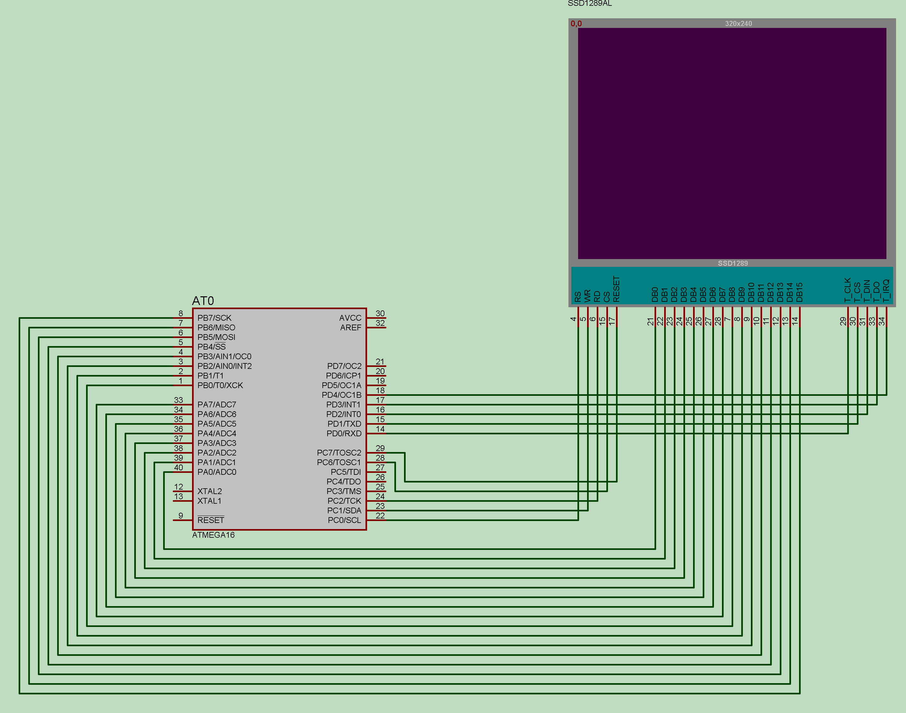
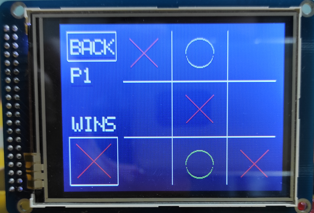
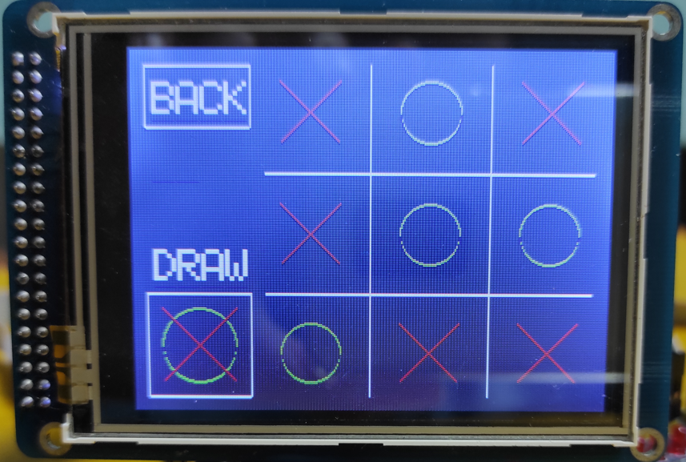
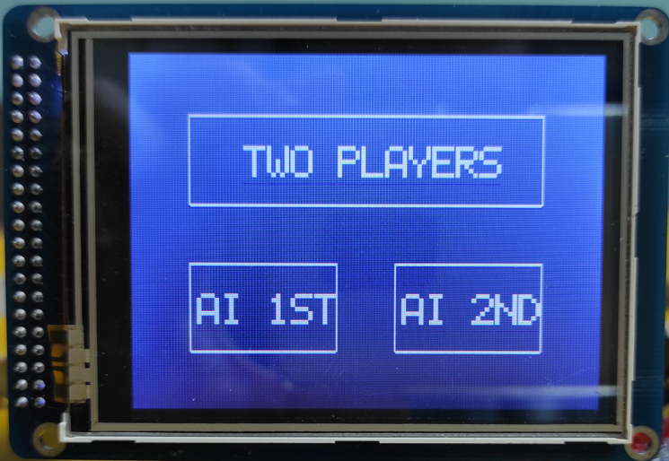

# Tic Tac Toe
This project was created as a final project for the Embedded Systems course.

## Functionalities
Tic tac toe game:
- 2 players
- AI plays first
- AI play second

## Hardware
- ATmega16A
- AVR mega 16/32 mini development board
- TFT 320 QVT touch screen

## Schematic

## Results

## NAPOMENA
Ovaj kod neće raditi s JTAG programatorom. JTAG koristi pinove PC2 - PC5, ali se PC2 koristi za čitanje podataka na prikaznom dijelu zaslona.

Ovo je moguće riješiti promjenom pina PC2 u kodu te prespajanjem žice na pin koji postavimo u kodu.